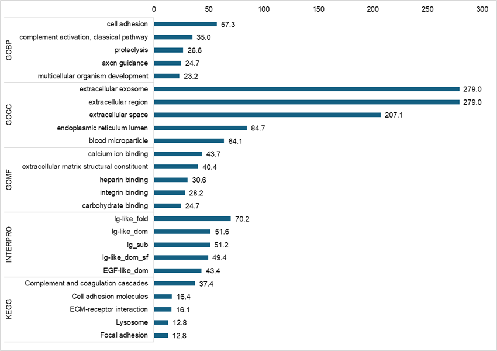

# __Visualize DAVID Annotation Chart__

</br>

* First Created : 2024/06/18
* Last Uploaded : 2024/06/24
* Revision info : 2024/06/24 Rev. 1.0

</br>

#### Index
1. What is DAVID
   1. Features
   2. Useful features
   
2. Visualizing DAVID Annotation Chart into Dot-Plot.
   1. Bar chart
   2. Dot plot (single, dual)
   
3. with DAVID API

</br>

## 1. What is DAVID
> DAVID

### 1.1. Features
> DAVID annotation table은 카테고리, Terminology, Pvalue 등의 feature를 포함한다.

- __Category__
  </br> Annotation 을 분류하는 가장 상위의 그룹. 붉은 글씨의 카테고리는 short list에 포함했다.
- __Term__
  </br> 해당 카테고리에서 분류된 Terminology. Identifier 가 같이 포함되어 delimiter로 구분됨. (GO의 경우 물결표 "~", KEGG와 INTERPRO는 콜론 ":")
- __Count__
  </br> Input entry 중 해당 Terminology 로 구분된 Gene 의 수.
- __%__
  </br> Count 를 DAVID ID가 존재하는 Input 수로 나누어 100을 곱한 값.
- __PValue__
  </br> Fisher의 정확검정에서 파생된 p-value. 피셔 정확검정의 p 와는 다른 값.
- __Genes__
  </br> Input entry 중 해당 Terminology 로 분류된 Gene 의 리스트. 콤마와 빈칸 (", ")으로 구분됨.
- __List Total__
  </br> Input entry 중 해당 Category ID 가 존재하는 Gene 의 수.
- __Pop Hits__
  </br> Category background 중 해당 Terminology 로 분류되는 Gene 의 수.
- __Pop Total__
  </br> Category background 전체 Gene 의 수.
- __Fold Enrichment__
  </br> 
- __Bonferroni__
  </br> Bonferroni p (p-value / number of test)
- __Benjamini__
  </br> Benjamini corrected p
- __FDR__
  </br> False Discovery Rate

### 1.2. Useful features
> 일명 파생 피쳐.

- __GeneRatio__
- __BgRatio__
- __-log2 or -log10 transformed value__

</br>

## 2. Visualizing DAVID Annotation Table

> DAVID Annotation 결과를 projection 해보자. 이 문서에서는 bar chart 와 dot plot 포맷을 사용해본다.

__준비물__
- [mq-open-david.txt][david-ex1]

---
### 2.1. Bar chart

#### Styles
- Single Category, Top N (Default:10, Descending order in feature)
  
</br>

  

- Multiple Categories (Default: GO/KEGG/INTERPRO), Top N (Default:5)

</br>

  

---
### 2.2. Dot plot

#### Styles
- Single
- Dual (Fold-change up/down)


```python
# python preference
import pandas as pd
import numpy as np
```

<br>

-

<br>

실행 결과
```bash
# bash preference
import pandas as pd
import numpy as np
```

<br>

내용 3


<br>

## 4. Future Directions
- 개선점 1
- 개선점 2

<br>

## Reference
(1) 저자명 et al. 저널명 연도, 권(호):쪽수. doi:10.xxxx/xxxx.

(2)


[Ext1]:https://blog.naver.com/simhc0714
[david-ex1]:https://github.com/simhc0714/oreome/blob/main/example/maxquant_opendata/mq_open-david.txt
